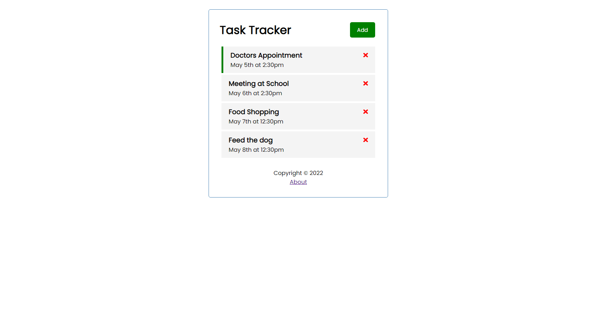

# Angular Projects

A small project to understand Angular core concepts.

## Task Tracker

A simple to-do list app.

[See 01-task-tracker folder](01-task-tracker)

    

### Features

- setting up an Angular app.
- understanding modular structure, defining global styles and using interpolations.
- generating components, handling input data and inline styles.
- managing events with Output and EventEmitter.
- mocking tasks, creating a Task interface and looping over tasks.
- displaying icons with @fortawesome/angular-fontawesome.
- creating a Task service, initiating and subscribing to Observable.
- setting up JSON Server as a fake back-end.
- creating, reading, updating and deleting data with HttpClientModule.
- handling user inputs with FormsModule.
- toggling button and form with Observable Subject.
- defining routes with RouterModule.

Based on [Angular Crash Course](https://www.youtube.com/watch?v=3dHNOWTI7H8) by Brad Traversy (2021).
