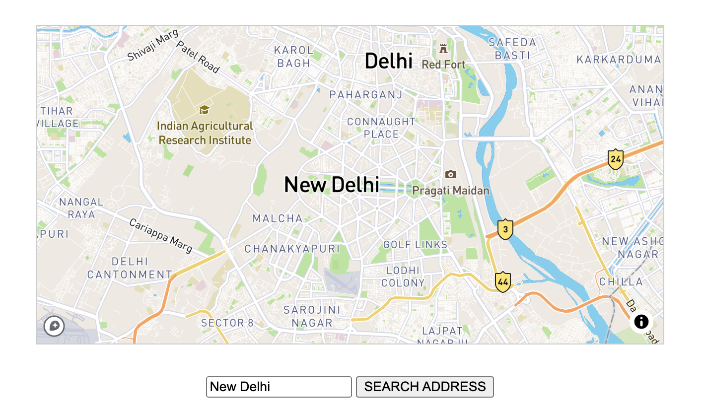
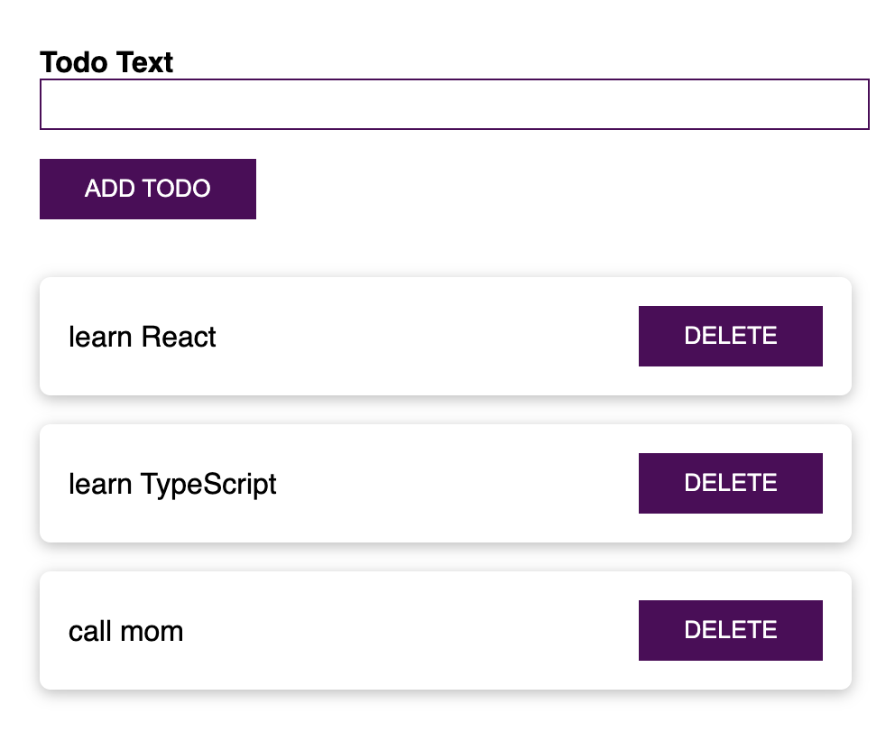

# TypeScript Projects

Some small projects to learn all about core types, generics and combine TypeScript with ReactJS or NodeJS / Express.

## Features

### Basics

- installing and setting up TypeScript.
- working with core types, tuples and enums.
- using union types and literal types with type aliases.
- utilizing function types, unknown and never types.
- configuring the TypeScript compiler.

### Classes and Interfaces

- creating a class and compiling to JavaScript.
- using a constructor function and the `this` keyword.
- working with private and public access modifiers.
- initializing a class with a shorthand.
- defining readonly properties.
- understanding inheritance.
- overriding properties and using the protected modifier.
- implementing getters and setters.
- enabling static methods and properties.
- building abstract classes.
- creating singletons and using private constructors.
- using interfaces with classes.
- extending interfaces and utilizing readonly property.
- defining interfaces as function types.
- handling optional parameters and properties.

### Advanced typing concepts

- using intersection types and type guards.
- understanding discriminated unions and type casting.
- discovering index properties and function overloads.
- handling external data with optional chaining and nullish coalescing.

### Generics

- discovering built-in generics.
- creating a generic function.
- working with constraints like `keyof`.
- building generic classes.
- using generic utility types like Partial and Readonly.

### Decorators

- working with decorator factories.
- attaching metadata to a class declaration.
- adding multiple decorators on property, accessor, parameter or method.
- returning and changing a class in a class decorator.
- creating an autobind decorator.
- validating data with decorators.

### Drag & Drop Project

- setting up a project.
- rendering a template and interacting with DOM elements.
- creating and using an autobind decorator.
- fetching user input.
- creating a reusable validation functionality.
- rendering project lists.

### Third party libraries and TypeScript

[See 10-third-party-libraries folder](10-third-party-libraries)

- setting up Vite with TypeScript.
- using JavaScript libraries like Lodash with TypeScript.
- using `declare` as a "last resort".
- transforming external data to some instance of class with class-transformer.
- validating data with class-validator.

### Select & Share a Place App

[See 11-select-share-place folder](11-select-share-place)

        

- setting up Webpack 5 with TypeScript.
- getting user input.
- setting up a Mapbox API token.
- using Axios to fetch coordinates for an entered address.
- rendering a map.

### React and TypeScript

[See 12-react-typescript folder](12-react-typescript)

        

- setting up a React and TypeScript project.
- building a basic to-do app.
- working with props and types for props.
- getting user input with `useRef`.
- working with state and types.
- adding styling.
- finding type definitions via NPM for other React libraries.

### NodeJS / Express and TypeScript

[See 13-node-express-typescript folder](13-node-express-typescript)

- executing TypeScript code with Node.js.
- setting up a project with Express, Nodemon and TypeScript.
- working with types in Node and Express apps.
- adding middleware and types on requests.
- working with controllers and parsing request bodies.
- building a basic REST API with CRUD operations.

Based on [Understanding TypeScript](https://www.udemy.com/course/understanding-typescript/) by Maximilian Schwarzmüller (2021).
