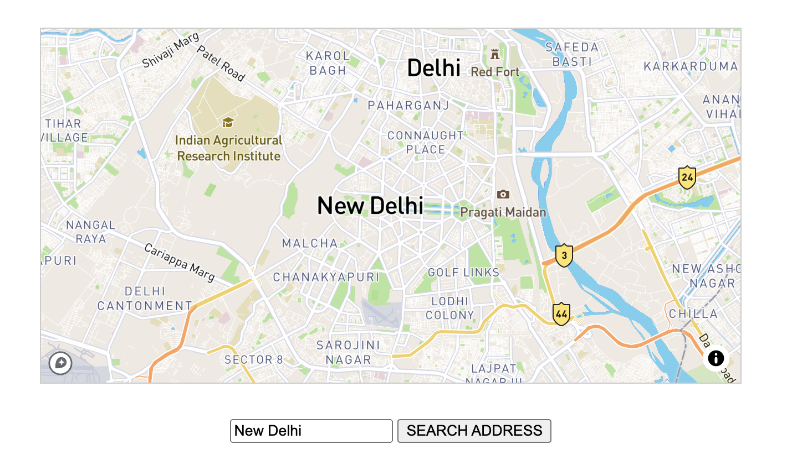
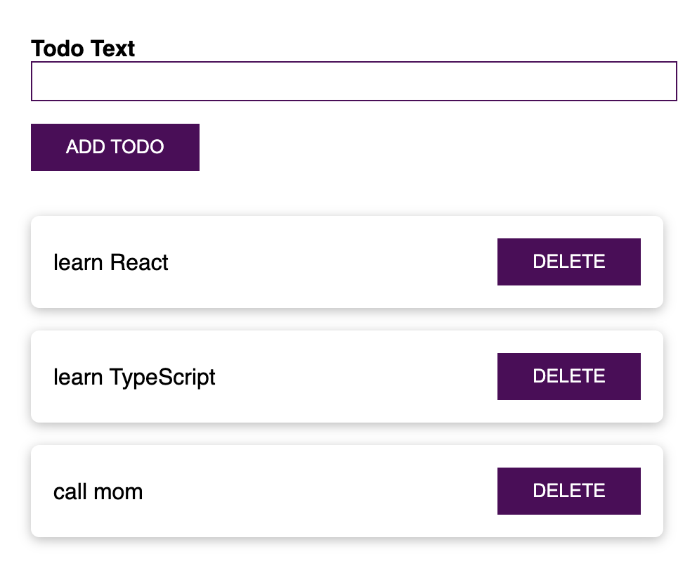

# TypeScript Projects

Some small projects to learn all about core types, generics and combine TypeScript with ReactJS or NodeJS / Express.

## Features

### Basics

- installing and setting up TypeScript.
- working with core types, tuples and enums.
- using union types and literal types with type aliases.
- utilizing function types, unknown and never types.
- configuring the TypeScript compiler.

# Classes and Interfaces

- creating a class and compiling to JavaScript.

### Third party libraries and TypeScript

- setting up Vite with TypeScript.
- using JavaScript libraries like Lodash with TypeScript.
- using `declare` as a "last resort".
- transforming external data to some instance of class with class-transformer.
- validating data with class-validator.

### Select & Share a Place App

        

- setting up Webpack 5 with TypeScript.
- getting user input.
- setting up a Mapbox API token.
- using Axios to fetch coordinates for an entered address.
- rendering a map.

### React and TypeScript

        

- setting up a React and TypeScript project.
- building a basic to-do app.
- working with props and types for props.
- getting user input with `useRef`.
- working with state and types.
- adding styling.
- finding type definitions via NPM for other React libraries.

### NodeJS / Express and TypeScript

- executing TypeScript code with Node.js.
- setting up a project with Express, Nodemon and TypeScript.
- working with types in Node and Express apps.
- adding middleware and types on requests.
- working with controllers and parsing request bodies.
- building a basic REST API with CRUD operations.

Based on [Understanding TypeScript](https://www.udemy.com/course/understanding-typescript/) by Maximilian Schwarzmüller (2021).
